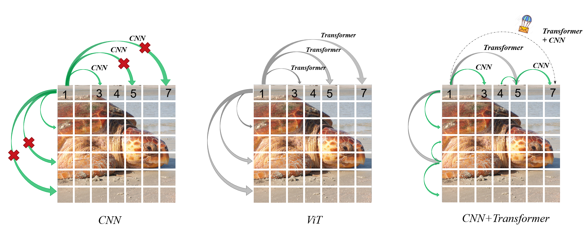
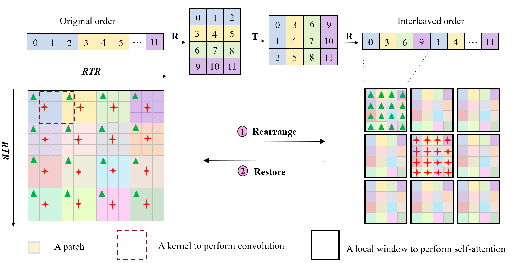

# Iwin Transformer

## Introduction

**Iwin Transformer** (the name `Iwin` stands for **I**nterleaved **win**dow) is initially described in [arxiv](https://arxiv.org/abs/2103.14030). It is a position-embedding-free hierarchical vision transformer, which can be fine-tuned directly from low to high resolution, through the collaboration of innovative interleaved window attention and depthwise separable convolution.





## Results on ImageNet with Pretrained Models

**ImageNet-1K and ImageNet-22K Pretrained Iwin Models**

| name | pretrain | resolution | acc@1 | #params | FLOPs | 22K model | 1K model |
| :---: | :---: | :---: | :---: | :---: | :---: |:---: |:---: |
| Iwin-T | ImageNet-1K | 224x224 | 82.0 | 30.2M | 4.7G | - | [github](https://github.com/Cominder/Iwin-Transformer/releases/download/v1.0/iwin_tiny_patch4_window7_224.pth)/[config](classification/configs/iwin/iwin_tiny_patch4_window7_224.yaml) |
| Iwin-S | ImageNet-1K | 224x224 | 83.4 | 51.6M | 9.0G | - | [github](https://github.com/Cominder/Iwin-Transformer/releases/download/v1.0/iwin_small_patch4_window7_224.pth)/[config](classification/configs/iwin/iwin_small_patch4_window7_224.yaml) |
| Iwin-S | ImageNet-1K | 384x384 | 84.3 | 51.6M | 27.7G | - | [github](https://github.com/Cominder/Iwin-Transformer/releases/download/v1.0/iwin_small_patch4_window12_384.pth)/[config](classification/configs/iwin/iwin_small_patch4_window12_384_finetune.yaml) |
| Iwin-S | ImageNet-1K | 512x512 | 84.4 | 51.6M | 52.0G | - | [github](https://github.com/Cominder/Iwin-Transformer/releases/download/v1.0/iwin_small_patch4_window16_512.pth)/[config](classification/configs/iwin/iwin_small_patch4_window16_512_finetune.yaml) |
| Iwin-S | ImageNet-1K | 1024x1024 | 83.8 | 51.6M | 207.9G | - | [github](https://github.com/Cominder/Iwin-Transformer/releases/download/v1.0/iwin_small_patch4_window16_1024.pth)/[config](configs/iwin/iwin_small_patch4_window16_1024_finetune.yaml) |
| Iwin-B | ImageNet-1K | 224x224 | 83.5 | 91.2M | 15.9G | - | [github](https://github.com/Cominder/Iwin-Transformer/releases/download/v1.0/iwin_base_patch4_window7_224.pth)/[config](classification/configs/iwin/iwin_base_patch4_window7_224.yaml) |
| Iwin-B | ImageNet-1K | 384x384 | 84.9 | 91.2M | 48.3G | - | [github](https://github.com/Cominder/Iwin-Transformer/releases/download/v1.0/iwin_base_patch4_window12_384.pth)/[config](classification/configs/iwin/iwin_base_patch4_window12_384_finetune.yaml) |
| Iwin-B | ImageNet-1K | 512x512 | 85.1 | 91.3M | 89.5G | - | [github](https://github.com/Cominder/Iwin-Transformer/releases/download/v1.0/iwin_base_patch4_window16_512.pth)/[config](classification/configs/iwin/iwin_base_patch4_window16_512_finetune.yaml) |
| Iwin-B | ImageNet-1K | 1024x1024 | 85.0 | 91.3M | 358.2G | - | [github](https://github.com/Cominder/Iwin-Transformer/releases/download/v1.0/iwin_base_patch4_window16_1024.pth)/[config](classification/configs/iwin/iwin_base_patch4_window16_1024_finetune.yaml) |
| Iwin-B | ImageNet-22K | 224x224 | 85.5 | 91.2M | 15.9G | [github](https://github.com/Cominder/Iwin-Transformer/releases/download/v1.0/iwin_base_patch4_window7_224_22k.pth)/[config](classification/configs/iwin/iwin_base_patch4_window7_224_22k.yaml) | [github](https://github.com/Cominder/Iwin-Transformer/releases/download/v1.0/iwin_base_patch4_window7_224_22kto1k.pth)/[config](configs/iwin/iwin_base_patch4_window7_224_22kto1k_finetune.yaml) |
| Iwin-B | ImageNet-22K | 384x384 | 86.6 | 91.2M | 48.3G | [github](https://github.com/Cominder/Iwin-Transformer/releases/download/v1.0/iwin_base_patch4_window12_384_22k.pth)/[config](classification/configs/iwin/iwin_base_patch4_window12_384_22k.yaml) | [github](https://github.com/Cominder/Iwin-Transformer/releases/download/v1.0/iwin_base_patch4_window12_384_22kto1k.pth)/[config](configs/iwin/iwin_base_patch4_window12_384_22kto1k_finetune.yaml) |
| Iwin-B | ImageNet-22K | 512x512 | 86.1 | 91.2M | 89.5G | [github](https://github.com/Cominder/Iwin-Transformer/releases/download/v1.0/iwin_base_patch4_window16_512_22k.pth)/[config](classification/configs/iwin/iwin_base_patch4_window16_512_22k.yaml) | [github](https://github.com/Cominder/Iwin-Transformer/releases/download/v1.0/iwin_base_patch4_window16_512_22kto1k.pth)/[config](configs/iwin/iwin_base_patch4_window16_512_22kto1k_finetune.yaml) |
| Iwin-B | ImageNet-22K | 1024x1024 | 85.6 | 91.2M | 358.2G | [github](https://github.com/Cominder/Iwin-Transformer/releases/download/v1.0/iwin_base_patch4_window16_1024_22k.pth)/[config](classification/configs/iwin/iwin_base_patch4_window16_1024_22k.yaml) | [github](https://github.com/Cominder/Iwin-Transformer/releases/download/v1.0/iwin_base_patch4_window16_1024_22kto1k.pth)/[config](configs/iwin/iwin_base_patch4_window16_1024_22kto1k_finetune.yaml) |
| Iwin-L | ImageNet-22K | 224x224 | 86.4 | 204.3M | 35.4G | [github](https://github.com/Cominder/Iwin-Transformer/releases/download/v1.0/iwin_large_patch4_window7_224_22k.pth)/[config](classification/configs/iwin/iwin_large_patch4_window7_224_22k.yaml) | [github](https://github.com/Cominder/Iwin-Transformer/releases/download/v1.0/iwin_large_patch4_window7_224_22kto1k.pth)/[config](configs/iwin/iwin_large_patch4_window7_224_22kto1k_finetune.yaml) |
| Iwin-L | ImageNet-22K | 384x384 | 87.4 | 204.3M | 106.6G | [github](https://github.com/Cominder/Iwin-Transformer/releases/download/v1.0/iwin_large_patch4_window12_384_22k.pth)/[config](classification/configs/iwin/iwin_large_patch4_window12_384_22k.yaml) | [github](https://github.com/Cominder/Iwin-Transformer/releases/download/v1.0/iwin_large_patch4_window12_384_22kto1k.pth)/[config](configs/iwin/iwin_large_patch4_window12_384_22kto1k_finetune.yaml) |


## Acknowledgements 

This repo is mainly built on [Swin](https://github.com/microsoft/Swin-Transformer). Thanks for the great works.


## Citation

```
@misc{huo2025iwin,
      title={Iwin Transformer: Hierarchical Vision Transformer using Interleaved Windows}, 
      author={Simin Huo and Ning Li},
      year={2025},
      eprint={2507.18405},
      archivePrefix={arXiv},
      primaryClass={cs.CV},
      url={https://arxiv.org/abs/2507.18405}, 
}
```


