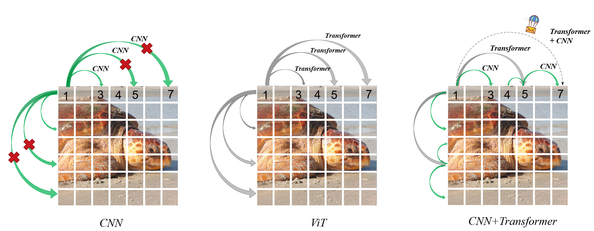
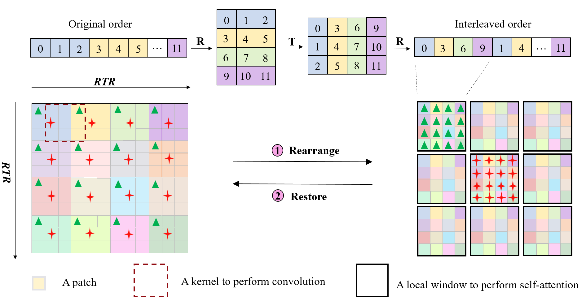

# Iwin Transformer

## Introduction

**Iwin Transformer** (the name `Iwin` stands for **I**nterleaved **win**dow) is initially described in [arxiv](https://arxiv.org/abs/2103.14030). It is a position-embedding-free hierarchical vision transformer, which can be fine-tuned directly from low to high resolution, through the collaboration of innovative interleaved window attention and depthwise separable convolution.




## Results on ImageNet with Pretrained Models

**ImageNet-1K and ImageNet-22K Pretrained Iwin Models**

| name | pretrain | resolution | acc@1 | #params | FLOPs | 22K model | 1K model |
| :---: | :---: | :---: | :---: | :---: | :---: |:---: |:---: |
| Iwin-T | ImageNet-1K | 224x224 | 82.0 | 30.2M | 4.7G | - | [github](https://github.com/Cominder/Iwin-Transformer/releases/download/v1.0/iwin_tiny_patch4_window7_224.pth)/[config](configs/iwin/iwin_tiny_patch4_window7_224.yaml) |
| Iwin-S | ImageNet-1K | 224x224 | 83.4 | 51.6M | 9.0G | - | [github](https://github.com/Cominder/Iwin-Transformer/releases/download/v1.0/iwin_small_patch4_window7_224.pth)/[config](configs/iwin/iwin_small_patch4_window7_224.yaml) |
| Iwin-S | ImageNet-1K | 384x384 | 84.3 | 51.6M | 27.7G | - | [github](https://github.com/Cominder/Iwin-Transformer/releases/download/v1.0/iwin_small_patch4_window12_384.pth)/[config](configs/iwin/iwin_small_patch4_window12_384_finetune.yaml) |
| Iwin-S | ImageNet-1K | 512x512 | 84.4 | 51.6M | 52.0G | - | [github](https://github.com/Cominder/Iwin-Transformer/releases/download/v1.0/iwin_small_patch4_window16_512.pth)/[config](configs/iwin/iwin_small_patch4_window16_512_finetune.yaml) |
| Iwin-S | ImageNet-1K | 1024x1024 | 83.8 | 51.6M | 207.9G | - | [github](https://github.com/Cominder/Iwin-Transformer/releases/download/v1.0/iwin_small_patch4_window16_1024.pth)/[config](configs/iwin/iwin_small_patch4_window16_1024_finetune.yaml) |
| Iwin-B | ImageNet-1K | 224x224 | 83.5 | 91.2M | 15.9G | - | [github](https://github.com/Cominder/Iwin-Transformer/releases/download/v1.0/iwin_base_patch4_window7_224.pth)/[config](configs/iwin/iwin_base_patch4_window7_224.yaml) |
| Iwin-B | ImageNet-1K | 384x384 | 84.9 | 91.2M | 48.3G | - | [github](https://github.com/Cominder/Iwin-Transformer/releases/download/v1.0/iwin_base_patch4_window12_384.pth)/[config](configs/iwin/iwin_base_patch4_window12_384_finetune.yaml) |
| Iwin-B | ImageNet-1K | 512x512 | 85.1 | 91.3M | 89.5G | - | [github](https://github.com/Cominder/Iwin-Transformer/releases/download/v1.0/iwin_base_patch4_window16_512.pth)/[config](configs/iwin/iwin_base_patch4_window16_512_finetune.yaml) |
| Iwin-B | ImageNet-1K | 1024x1024 | 85.0 | 91.3M | 358.2G | - | [github](https://github.com/Cominder/Iwin-Transformer/releases/download/v1.0/iwin_base_patch4_window16_1024.pth)/[config](configs/iwin/iwin_base_patch4_window16_1024_finetune.yaml) |
| Iwin-B | ImageNet-22K | 224x224 | 85.5 | 91.2M | 15.9G | [github](https://github.com/Cominder/Iwin-Transformer/releases/download/v1.0/iwin_base_patch4_window7_224_22k.pth)/[config](configs/iwin/iwin_base_patch4_window7_224_22k.yaml) | [github](https://github.com/Cominder/Iwin-Transformer/releases/download/v1.0/iwin_base_patch4_window7_224_22kto1k.pth)/[config](configs/iwin/iwin_base_patch4_window7_224_22kto1k_finetune.yaml) |
| Iwin-B | ImageNet-22K | 384x384 | 86.6 | 91.2M | 48.3G | - | [github](https://github.com/Cominder/Iwin-Transformer/releases/download/v1.0/iwin_base_patch4_window12_384_22kto1k.pth)/[config](configs/iwin/iwin_base_patch4_window12_384_22kto1k_finetune.yaml) |
| Iwin-B | ImageNet-22K | 512x512 | 86.1 | 91.2M | 89.5G | - | [github](https://github.com/Cominder/Iwin-Transformer/releases/download/v1.0/iwin_base_patch4_window16_512_22kto1k.pth)/[config](configs/iwin/iwin_base_patch4_window16_512_22kto1k_finetune.yaml) |
| Iwin-B | ImageNet-22K | 1024x1024 | 85.6 | 91.2M | 358.2G | - | [github](https://github.com/Cominder/Iwin-Transformer/releases/download/v1.0/iwin_base_patch4_window16_1024_22kto1k.pth)/[config](configs/iwin/iwin_base_patch4_window16_1024_22kto1k_finetune.yaml) |
| Iwin-L | ImageNet-22K | 224x224 | 86.4 | 204.3M | 35.4G | [github](https://github.com/Cominder/Iwin-Transformer/releases/download/v1.0/iwin_large_patch4_window7_224_22k.pth)/[config](configs/iwin/iwin_large_patch4_window7_224_22k.yaml) | [github](https://github.com/Cominder/Iwin-Transformer/releases/download/v1.0/iwin_large_patch4_window7_224_22kto1k.pth)/[config](configs/iwin/iwin_large_patch4_window7_224_22kto1k_finetune.yaml) |
| Iwin-L | ImageNet-22K | 384x384 | 87.4 | 204.3M | 106.6G | - | [github](https://github.com/Cominder/Iwin-Transformer/releases/download/v1.0/iwin_large_patch4_window12_384_22kto1k.pth)/[config](configs/iwin/iwin_large_patch4_window12_384_22kto1k_finetune.yaml) |


## Usage
### Evaluation

To evaluate a pre-trained `Iwin Transformer` on ImageNet val, run:

```bash
python -m torch.distributed.launch --nproc_per_node <num-of-gpus-to-use> --master_port 12345 main.py --eval \
--cfg <config-file> --resume <checkpoint> --data-path <imagenet-path> 
```

For example, to evaluate the `Iwin-B` with a single GPU:

```bash
python -m torch.distributed.launch --nproc_per_node 1 --master_port 12345 main.py --eval \
--cfg configs/iwin_base_patch4_window7_224.yaml --resume iwin_base_patch4_window7_224.pth --data-path <imagenet-path>
```

### Training from scratch on ImageNet-1K

To train a `Iwin Transformer` on ImageNet from scratch, run:

```bash
python -m torch.distributed.launch --nproc_per_node <num-of-gpus-to-use> --master_port 12345  main.py \ 
--cfg <config-file> --data-path <imagenet-path> [--batch-size <batch-size-per-gpu> --output <output-directory> --tag <job-tag>]
```

**Notes**:

- To use zipped ImageNet instead of folder dataset, add `--zip` to the parameters.
    - To cache the dataset in the memory instead of reading from files every time, add `--cache-mode part`, which will
      shard the dataset into non-overlapping pieces for different GPUs and only load the corresponding one for each GPU.
- When GPU memory is not enough, you can try the following suggestions:
    - Use gradient accumulation by adding `--accumulation-steps <steps>`, set appropriate `<steps>` according to your need.
    - Use gradient checkpointing by adding `--use-checkpoint`, e.g., it saves about 60% memory when training `Iwin-B`.
      Please refer to [this page](https://pytorch.org/docs/stable/checkpoint.html) for more details.
    - We recommend using multi-node with more GPUs for training very large models, a tutorial can be found
      in [this page](https://pytorch.org/tutorials/intermediate/dist_tuto.html).
- To change config options in general, you can use `--opts KEY1 VALUE1 KEY2 VALUE2`, e.g.,
  `--opts TRAIN.EPOCHS 100 TRAIN.WARMUP_EPOCHS 5` will change total epochs to 100 and warm-up epochs to 5.
- For additional options, see [config](config.py) and run `python main.py --help` to get detailed message.

For example, to train `Iwin Transformer` with 8 GPU on a single node for 300 epochs, run:

`Iwin-T`:

```bash
python -m torch.distributed.launch --nproc_per_node 8 --master_port 12345  main.py \
--cfg configs/iwin_tiny_patch4_window7_224.yaml --data-path <imagenet-path> --batch-size 128 
```

`Iwin-S`:

```bash
python -m torch.distributed.launch --nproc_per_node 8 --master_port 12345  main.py \
--cfg configs/iwin_small_patch4_window7_224.yaml --data-path <imagenet-path> --batch-size 128 
```

`Iwin-B`:

```bash
python -m torch.distributed.launch --nproc_per_node 8 --master_port 12345  main.py \
--cfg configs/iwin_base_patch4_window7_224.yaml --data-path <imagenet-path> --batch-size 64 \
--accumulation-steps 2 [--use-checkpoint]
```

### Pre-training on ImageNet-22K

For example, to pre-train a `Iwin-B` model on ImageNet-22K:

```bash
python -m torch.distributed.launch --nproc_per_node 8 --master_port 12345  main.py \
--cfg configs/iwin_base_patch4_window7_224_22k.yaml --data-path <imagenet22k-path> --batch-size 64 \
--accumulation-steps 8 [--use-checkpoint]
```

### Fine-tuning on higher resolution

For example, to fine-tune a `Iwin-B` model pre-trained on 224x224 resolution to 384x384 resolution:

```bashs
python -m torch.distributed.launch --nproc_per_node 8 --master_port 12345  main.py \
--cfg configs/iwin_base_patch4_window12_384_finetune.yaml --pretrained iwin_base_patch4_window7_224.pth \
--data-path <imagenet-path> --batch-size 64 --accumulation-steps 2 [--use-checkpoint]
```

### Fine-tuning from a ImageNet-22K(21K) pre-trained model

For example, to fine-tune a `Iwin-B` model pre-trained on ImageNet-22K(21K):

```bashs
python -m torch.distributed.launch --nproc_per_node 8 --master_port 12345  main.py \
--cfg configs/iwin_base_patch4_window7_224_22kto1k_finetune.yaml --pretrained iwin_base_patch4_window7_224_22k.pth \
--data-path <imagenet-path> --batch-size 64 --accumulation-steps 2 [--use-checkpoint]
```

### Throughput

To measure the throughput, run:

```bash
python -m torch.distributed.launch --nproc_per_node 1 --master_port 12345  main.py \
--cfg <config-file> --data-path <imagenet-path> --batch-size 64 --throughput --disable_amp
```

## Acknowledgements 

This repo is mainly built on [Swin](https://github.com/microsoft/Swin-Transformer). Thanks for the great work.


## Citation

```
@misc{huo2025iwin,
      title={Iwin Transformer: Hierarchical Vision Transformer using Interleaved Windows}, 
      author={Simin Huo and Ning Li},
      year={2025},
      eprint={2507.18405},
      archivePrefix={arXiv},
      primaryClass={cs.CV},
      url={https://arxiv.org/abs/2507.18405}, 
}
```


