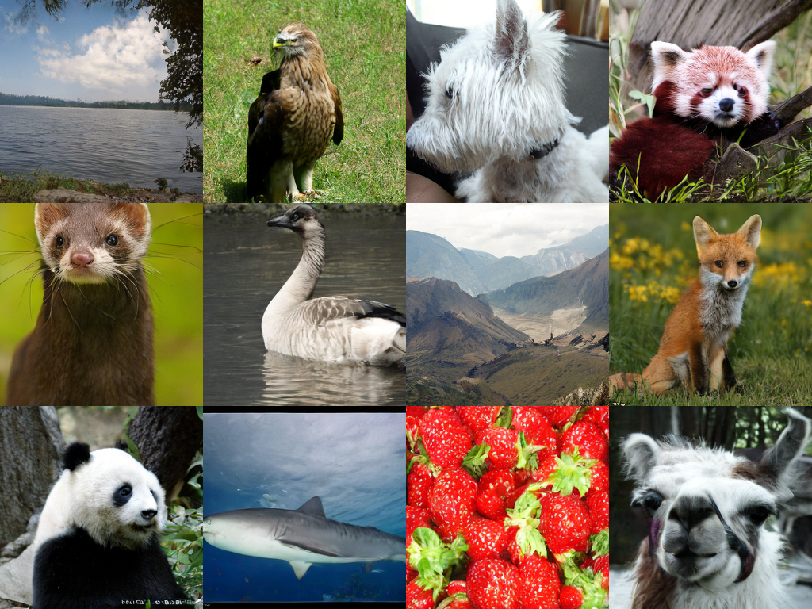

### Get Vision Foundation Model Aligned VAE (VA-VAE).

- Download the pre-trained checkpoint from [here](https://huggingface.co/hustvl/vavae-imagenet256-f16d32-dinov2/blob/main/vavae-imagenet256-f16d32-dinov2.pt). It is a pre-trained LDM (VQGAN-KL) VAE with 16x downsample ratio and 32-channel latent dimension (f16d32).

- Modify `tokenizer/configs/vavae_f16d32.yaml` to use your own checkpoint path.

### Extract ImageNet Latents

- We use VA-VAE to extract latents for all ImageNet images. During extraction, we apply random horizontal flips to maintain consistency with previous works. Run:

- Modify `extract_features.py` to your own data path and {output_path}.
    
    ```
    bash run_extraction.sh tokenizer/configs/vavae_f16d32.yaml
    ```

- (Optional) Also, you can download the pre-extracted ImageNet latents from [here](https://huggingface.co/datasets/hustvl/imagenet256-latents-vave-f16d32-dinov2/tree/main/splits). These are split tar.gz files, please use `cat split_* > imagenet_latents.tar.gz && tar -xf imagenet_latents.tar.gz` to merge and extract them.

### Train FashDiT

- First, modify some necessary paths as required in ``configs/flashdit_xl_vavae_f16d32.yaml``.

- Run the following command to start training. It train 64 epochs with FlashDiT-XL/1 with less memory usage and faster training speed than lightningdit.

    ```
    bash run_train.sh configs/flashdit_xl_vavae_f16d32.yaml
    ```

### Inference

- Let's see some demo inference results first before we calculate FID score.

    Run the following command:
    ```
    bash run_fast_inference.sh configs/flashdit_xl_vavae_f16d32.yaml
    ```
    Images will be saved into ``demo_images/demo_samples.png``, e.g. the following one (it is generated from [the ckpt](https://huggingface.co/cominder/flashdit/blob/main/flashdit-xl-win8-imagenet256-56ep.pt)):
    <div align="center">
    
    </div>

- Calculate FID score:

    ```
    bash run_fid_eval.sh configs/flashdit_xl_vavae_f16d32.yaml
    ```
    It will provide a reference FID score. For the final reported FID score in the publication, you need to use ADM's evaluation code from [here](https://github.com/openai/guided-diffusion/) for standardized testing.
