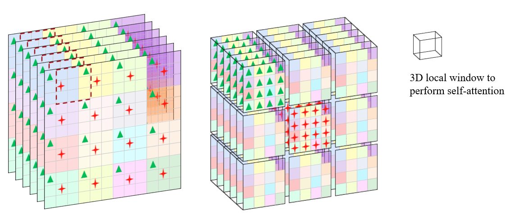

# Video Iwin Transformer



## Results and Models

### Kinetics 400
| Backbone | Pretrain | Lr Schd | spatial crop | acc@1 | acc@5 | #params | FLOPs | config | model |
| :---: | :---: | :---: | :---: | :---: | :---: | :---: | :---: | :---: | :---: |
| Iwin-T | ImageNet-1K | 30ep | 224 | 79.1 | 93.8 | 29.8M | 74G | [config](video_recognition/configs/recognition/iwin/iwin_tiny_patch244_window77_kinetics400_1k.py) |[github](https://github.com/Cominder/Iwin-Transformer/releases/download/v1.0/iwin_tiny_patch244_window77_kinetics400_1k.pth) |
| Iwin-S | ImageNet-1K | 30ep | 224 | 80.0 | 94.1 | 51.1M | 140G | [config](video_recognition/configs/recognition/iwin/iwin_small_patch244_window77_kinetics400_1k.py) | [github](https://github.com/IwinTransformer/releases/download/v1.0/iwin_small_patch244_window77_kinetics400_1k.pth) |


## Usage

###  Installation

Please refer to [install.md](docs/install.md) for installation.

We also provide docker file [cuda10.1](docker/docker_10.1) ([image url](https://hub.docker.com/layers/ninja0/mmdet/pytorch1.7.1-py37-cuda10.1-openmpi-mmcv1.3.3-apex-timm/images/sha256-06d745934cb255e7fdf4fa55c47b192c81107414dfb3d0bc87481ace50faf90b?context=repo)) and [cuda11.0](docker/docker_11.0) ([image url](https://hub.docker.com/layers/ninja0/mmdet/pytorch1.7.1-py37-cuda11.0-openmpi-mmcv1.3.3-apex-timm/images/sha256-79ec3ec5796ca154a66d85c50af5fa870fcbc48357c35ee8b612519512f92828?context=repo)) for convenient usage.

###  Data Preparation

Please refer to [data_preparation.md](docs/data_preparation.md) for a general knowledge of data preparation.
The supported datasets are listed in [supported_datasets.md](docs/supported_datasets.md).

Kinetics-400 annotation file [k400_val](https://github.com/SwinTransformer/storage/releases/download/v1.0.6/k400_val.txt), [k400_train](https://github.com/SwinTransformer/storage/releases/download/v1.0.6/k400_train.txt) for better comparison.

### Inference
```
# single-gpu testing
python tools/test.py <CONFIG_FILE> <CHECKPOINT_FILE> --eval top_k_accuracy

# multi-gpu testing
bash tools/dist_test.sh <CONFIG_FILE> <CHECKPOINT_FILE> <GPU_NUM> --eval top_k_accuracy
```

### Training

To train a video recognition model with pre-trained image models (for Kinetics-400 and Kineticc-600 datasets), run:
```
# single-gpu training
python tools/train.py <CONFIG_FILE> --cfg-options model.backbone.pretrained=<PRETRAIN_MODEL> [model.backbone.use_checkpoint=True] [other optional arguments]

# multi-gpu training
bash tools/dist_train.sh <CONFIG_FILE> <GPU_NUM> --cfg-options model.backbone.pretrained=<PRETRAIN_MODEL> [model.backbone.use_checkpoint=True] [other optional arguments]
```
For example, to train a `Iwin-T` model for Kinetics-400 dataset  with  8 gpus, run:
```
bash tools/dist_train.sh configs/recognition/iwin/iwin_tiny_patch244_window877_kinetics400_1k.py 8 --cfg-options model.backbone.pretrained=<PRETRAIN_MODEL> 
```

**Note:** `use_checkpoint` is used to save GPU memory. Please refer to [this page](https://pytorch.org/docs/stable/checkpoint.html) for more details.


### Apex (optional):
We use apex for mixed precision training by default. To install apex, use our provided docker or run:
```
git clone https://github.com/NVIDIA/apex
cd apex
pip install -v --disable-pip-version-check --no-cache-dir --global-option="--cpp_ext" --global-option="--cuda_ext" ./
```
If you would like to disable apex, comment out the following code block in the [configuration files](configs/recognition/iwin):
```
# do not use mmcv version fp16
fp16 = None
optimizer_config = dict(
    type="DistOptimizerHook",
    update_interval=1,
    grad_clip=None,
    coalesce=True,
    bucket_size_mb=-1,
    use_fp16=True,
)
```

## Citing Iwin Transformer
```
@misc{huo2025iwin,
      title={Iwin Transformer: Hierarchical Vision Transformer using Interleaved Windows}, 
      author={Simin Huo and Ning Li},
      year={2025},
      eprint={2507.18405},
      archivePrefix={arXiv},
      primaryClass={cs.CV},
      url={https://arxiv.org/abs/2507.18405}, 
}
```


## Other Links

> **Image Classification**: See [Iwin Transformer for Image Classification](https://github.com/Cominder/Iwin-Transformer/classification).

> **Object Detection**: See [Iwin Transformer for Object Detection](https://github.com/Cominder/Iwin-Transformer/detection).

> **Semantic Segmentation**: See [Iwin Transformer for Semantic Segmentation](https://github.com/Cominder/Iwin-Transformer/segmentation).

